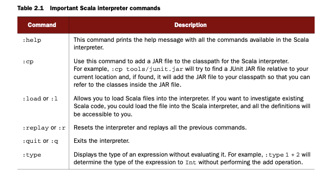
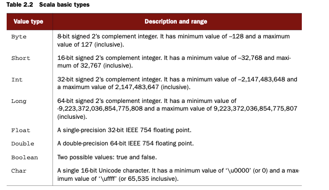
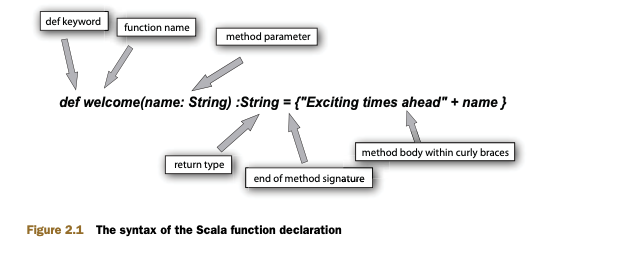
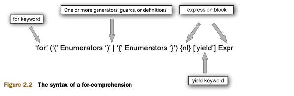

# scala-101-book


Scala is unique. It is a multi-paradigm programming language that combines both functional and object-oriented languages

## part 1 - Scala: the basics

If you have existing Java applications and are looking for a language that will improve your productivity and at the same time reuse your existing Java codebase, you’ll like Scala’s Java integration and the fact that Scala runs on the JVM platform.

To understand and benefit from Scala collections, you need to know two concepts: type parameterization and higher-order functions. Type parameterization allows you to create types that take another type as a parameter (similar to Java generics). Higher-order functions let you create functions that take other functions as parame- ters. These two concepts allow you to create generic and reusable components, like Scala collections.

A recent addition to the collection library is parallel collections. Scala par- allel collections allow you to solve data parallelism problems in Scala with ease.

### Why Scala?

Scala is a general-purpose programming language that runs on Java Virtual Machine (JVM) and .NET platforms.

Among the heap of programming languages like Groovy, Ruby, Clojure, Erlang, and F#, why should you learn Scala?

Scala is. It’s a feature-rich language that’s used in various types of applications, starting with building a large messaging layer for social networking sites such as Twitter to creating an application build tool like SBT(Simple Build Tool). Because of this scala-bility, the name of the language is Scala.

Scala is one of those rare languages that successfully integrates both object-oriented and functional lan- guage features. This makes Scala powerful because it gives you more in your toolbox to solve programming problems.

#### What’s Scala?

Scala is a general-purpose programming language designed to express common pro- gramming patterns in a concise, elegant, and type-safe way. It smoothly integrates fea- tures of object-oriented and functional programming languages, enabling programmers to be more productive. Martin Odersky (the creator of Scala) and his team started development on Scala in 2001 in the programming methods laboratory at EPFL (École Polytechnique Fédérale de Lausanne). Scala made its public debut in January 2004 on the JVM platform and a few months later on the .NET platform.

scala on .net has some support issues, that need convert java  to .net library.

#### Scala as an object-oriented language

Think of objects as data structures that consist of fields and methods. Object orientation helps to provide structure to your application using classes and objects. It also facilitates composition so you can create large applications from smaller building blocks.

What makes a language purely object-oriented? Although the exact definition of the term depends on whom you ask, most will agree a pure object-oriented language should have the following characteristics:

* Encapsulation/information hiding.
* Inheritance.
* Polymorphism/dynamic binding.
* All predefined types are objects.
* All operations are performed by sending messages to objects.
* All user-defined types are objects.

Scala supports all these qualities and uses a pure object-oriented model similar to that of Smalltalk (a pure object-oriented language created by Alan Kay around 1980), where every value is an object, and every operation is a message send.

1+2

In Scala this expression is interpreted as 1.+(2) by the Scala compiler. That means you’re invoking a + operation on an integer object (in this case, 1) by passing 2 as a parameter.

Scala treats operator names like ordinary identifiers. An identifier in Scala is either a sequence of letters and digits starting with a letter or a sequence of operator characters. In addition to +, it’s possible to define methods like <=, -, or *.

Along with the pure object-oriented features, Scala has made some innovations on OOP space:

* Modular mixin composition — This feature of Scala has traits in common with both Java interfaces and abstract classes. You can define contracts using one or more traits and provide implementations for some or all of the methods.
* Self-type — A mixin doesn’t depend on any methods or fields of the class that it’s mixed into, but sometimes it’s useful to use fields or methods of the class it’s mixed into, and this feature of Scala is called self-type.
* Type abstraction — There are two principle forms of abstraction in programming languages: parameterization and abstract members. Scala supports both forms of abstraction uniformly for types and values.

DEFINITION A mixin is a class that provides certain functionality to be inher- ited by a subclass and isn’t meant for instantiation by itself. A mixin could also be viewed as an interface with implemented methods.

#### Scala as a functional language

Functional programming is a programming paradigm that treats computation as the evaluation of mathematical functions and avoids state and mutable data.

Mutable vs. immutable data

An object is called mutable when you can alter the contents of the object if you have a reference to it. In the case of an immutable object, the contents of the object can’t be altered if you have a reference to it.

It’s easy to create a mutable object; all you have to do is provide access to the muta- ble state of the object. The disadvantage of mutable objects is keeping track of the changes. In a multithreaded environment you need lock/synchronization techniques to avoid concurrent access. For immutable objects, you don’t have to worry about these situations.

Functional programming takes more of a mathematical view of the world, where pro- grams are composed of functions that take certain input and produce values and pos- sibly other functions. The building blocks of functional programming are neither objects nor procedures (C programming style) but functions. The simple definition of functional programming is programming with functions.

It’s important to understand what is meant by function here. A function relates every value of the domain (the input) to exactly one value of the codomain (the out- put). 

Another aspect of functional program- ming is that it doesn’t have side effects or mutability. The benefits of not having mutability and side effects in functional programs are that the programs are much easier to understand (it has no side effects), reason about, and test because the activity of the function is completely local and it has no external effects. Another huge benefit of functional programming is ease of concurrent programming. Concur- rency becomes a nonissue because there’s no change (immutability) to coordinate between processes or threads.


Functional programming languages that support this style of programming provide at least some of the following features:

* Higher-order functions (chapter 4)
* Lexical closures (chapter 3)
* Pattern matching (chapters 2 and 3)
* Single assignment (chapter 2)
* Lazy evaluation (chapter 2)
* Type inference (chapter 2)
* Tail call optimization (chapter 5)
* List comprehensions (chapters 2 and 4)
* Mondadic effects (chapter 5)

The function associates each element in the domain with exactly one element in the codomain. For example, f(x) = y could be interpreted as 

x has a relationship f with y or x maps to y via f

Let’s see this in a programming context. Say you have the following function that takes two input parameters and produces the sum of them:
```scala
def addFunction(a: Int, b: Int) = a + b
```
For a given input set (2, 3) this function always returns 5, but the following function
currentTime doesn’t fit the definition: 
```scala
def currentTime(timezone: TimeZone) = Calendar.getInstance(timezone).getTime
```
For the given timezone GMT, it returns different results based on the time of day.

One other interesting property of a mathematical function is referential transparency, which means that an expression can be replaced with its result. In the case of add- Function, we could replace all the calls made to it with the output value, and the behavior of the program wouldn’t change.

Side effects

A function or expression is said to have a side effect if, in addition to pro- ducing a value, it modifies some state or has an observable interaction with calling functions or the outside world. A func- tion might modify a global or a static variable, modify one of its arguments, raise an exception, write data to a display or file, read data, or call other functions having side effects. In the presence of side effects, a program’s behavior depends on its history of execution.

Scala, put simply, is not a pure functional language. In a pure functional language modifications are excluded, and variables are used in a mathematical sense, with identifiers referring to immutable and persistent values. An example of a pure func- tional language is Haskell.


Scala supports both types of variables: single-assignment variables (also called val- ues) that don’t change their value throughout their lifetime and variables that point to a mutable state or could be reassigned to other objects. Even though you should use immutable objects whenever possible, Scala as a language doesn’t provide any restrictions. The restriction is purely conventional. A good rule of thumb is to always default to val and use variables when it’s absolutely necessary.


Scala supports most of them, but to keep it simple Scala is a functional language in the sense that functions are first-class values. That means that in Scala, every function is a value (like some integer value 1 or some string value "foo"), and like any values, you can pass them as parameters and return them from other functions. In Scala you can assign a function (x: Int) => x + 1 to a val inc and use that to invoke that function:
```scala
val inc = (x : Int) => x + 1
inc(1)
```
Here val represents a single assignment variable (like Java final variables) with a value that can’t be changed after the assignment. The output of the function call is 2.

In the following example you’ll see how to pass functions as parameters to another function and get the result:
```scala
List(1, 2, 3).map((x: Int) => x + 1)
```
In this case you’re passing an increment function to another function called map, and the output produced by the invocation of the map function will be List(2, 3, 4). Based on the output you can see that map is invoking the given function for each ele- ment in the list. Don’t worry about the syntax right now; you’ll learn about it in detail in later chapters.

#### Scala as a multi-paradigm language

Scala is a multi-paradigm language because it supports both functional and OOP pro- gramming. Scala is the first to unify functional programming and OOP in a statically typed language for the JVM. 

The goal of multi-paradigm computing is to provide a number of problem-solving styles so a programmer can select the solution that best matches the characteristics of the problem to be solved. This provides a framework where you can work in a variety of styles and mix the constructs from different ones. Functional programming makes it easy to build interesting things from simple parts (functions), and OOP makes it easy to adopt and extend complex systems using inheritance, classes, and so on.

Research results from the psychology of programming indicate that expertise in programming is far more strongly related to the number of different programming styles understood by an individual than it is the number of years of experience in programming.”


In Scala, functions are treated as objects.

FUNCTIONS AS OBJECTS

Scala, being a functional language, treats functions as values, and you saw one example of assigning a function to a variable. Because all values in Scala are objects.
```scala
List(1, 2, 3).map((x: Int) => x + 1)
```
You’re passing the function (x:Int) => x + 1 to the method map as a parameter. When the compiler encounters such a call, it replaces the function parameter with an object, as in the following:

```scala
List(1, 2, 3).map(new Function1[Int, Int]{ def apply(x:Int): Int = x + 1})
```

when the Scala compiler encounters functions with one parameter, it replaces that call with an instance of class scala.Function1, which implements a method called apply. 

#### Scala as a scalable and extensible language


cala stands for scalable language.7 One of the design goals of Scala is to create a lan- guage that will grow and scale with your demand. Scala is suitable for use as a scripting language, as well as for large enterprise applications. Scala’s component abstraction, succinct syntax, and support for both object-oriented and functional programming make the language scalable.

Scala also provides a unique combination of language mechanisms that makes it easy to add new language constructs in the form of libraries. You could use any method as an infix or postfix operator, and closures in Scala can be passed as “pass by name” arguments to other functions (see the next listing). These features make it eas- ier for developers to define new constructs.

Let’s create a new looping construct called loopTill, which is similar to the while loop in the following listing.

```scala

def loopTill(cond: => Boolean)(body: => Unit): Unit = {
 if (cond) {
    body
    loopTill(cond)(body)
 }
}

var i = 10

loopTill (i > 0) {
    println(i)
    i -= 1 
}

```

In this code you’re creating a new loopTill construct by declaring a method called loopTill that takes two parameters. The first parameter is the condition (i > 0) and the second parameter is a closure. As long as the condition evaluates to true, the loopTill function will execute the given closure.

Closure is a first-class function with free variables that are bound in the lexical environment. In the loopTill example, the free variable is i. Even though it’s defined outside the closure, you could still use it inside. The second parameter in the loopTill example is a closure, and in Scala that’s represented as an object of type scala.Function0.

Extending a language with a library is much easier than extending the language itself because you don’t have to worry about backward compatibility. For example, Scala actor implementation (defined in section 1.2.2) is provided as a library and isn’t part of the Scala language. When the first actor implementation didn’t scale that well, another actor implementation was added to Scala without breaking anything.

#### Scala runs on the JVM

he best thing about Java is not the language but the JVM. A JVM is a fine piece of machinery, and the Hotspot team has done a good job in improving its performance over the years. Being a JVM language, Scala integrates well with Java and its ecosystem, including tools, libraries, and IDEs. Now most of the IDEs ship with the Scala plug-in so that you can build, run, and test Scala applications inside the IDE. To use Scala you don’t have to get rid of all the investments you’ve made in Java so far. Instead you can reuse them and keep your ROI coming.

cala compiles to Java byte code, and at the byte-code level you can’t distinguish between Java code and Scala code. They’re the same. You could use the Java class file disassembler javap to disassemble Scala byte code (chapter 11 looks into this in more detail) as you could for Java classes.

why Scala?

The current crisis

An interesting phenomenon known as “Andy giveth, and Bill taketh away” comes from the fact that no matter how fast processors become, we software people find a way to use up that speed. 

End of Moore’s law

According to Moore’s law, the number of transistors per square inch on a chip will double every 18 months. Unfortunately, Intel and other CPU manufacturers are finally hitting the wall8 with Moore’s law and instead are taking the route of multicore pro- cessors. The good news is that processors are going to continue to become more pow- erful, but the bad news is that our current applications and programming environments need to change to take advantage of multicore CPUs.

Programming for multicores

Concurrency. Concurrency will be, if it isn’t already, the way we can write software to solve our large, distributed, complex enterprise problems if we want to exploit the CPU throughputs. Who doesn’t want efficient and good performance from their appli-
cations? We all do.

A few people have been doing parallel and concurrent programming for a long
time, but it still isn’t mainstream or common among enterprise developers. One rea- son is that concurrent programming has its own set of challenges. In the traditional thread-based concurrency model, the execution of the program is split into multiple concurrently running tasks (threads), and each operates on shared memory. This leads to hard-to-find race conditions and deadlock issues that can take weeks and months to isolate, reproduce, and fix. It’s not the threads but the shared memory that’s the root of all the concurrency problems. The current concurrency model is too hard for developers to grok, and we need a better concurrent programming model that will help developers easily write and maintain concurrent programs.

Scala takes a totally different approach to concurrency: the Actor model. An actor9 is a mathematical model of concurrent computation that encapsulates data, code, and its own thread of control and communicates asynchronously using immutable (no side effects) message-passing techniques. The basic Actor architecture relies on a shared-nothing policy and is lightweight in nature. It’s not analogous to a Java thread; it’s more like an event object that gets scheduled and executed by a thread. The Scala Actor model is a better way to handle concurrency issues. Its shared-nothing architec- ture and asynchronous message-passing techniques make it an easy alternative to existing thread-based solutions.

History of the Actor model

The Actor model was first proposed by Carl Hewitt in 1973 in his paper “A Universal Modular ACTOR Formalism for Artificial Intelligence” and was later on improved by Gul Agha (“ACTORS: A Model of Concurrent Computation in Distributed Systems”).
Erlang was the first programming language to implement the Actor model. Erlang is a general-purpose concurrent programming language with dynamic typing. After the success of the Erlang Actor model at Ericsson, Facebook, and Yahoo!, it became a good alternative for handling concurrency problems, and Scala inherited it. In Scala, actors are implemented as a library that allows developers to have their own imple- mentation. In chapters 7 and 12 you’ll look into various Scala actor implementations.

Traditionally, programming multicore processors is more complex than programming uniprocessors and it requires platform-specific knowledge. It’s also harder to maintain and manage these codebases. To make parallel programming easier, Scala provides higher abstractions in the form of a parallel collections library that hides parallel algo- rithms. For example, to square up each element of a List in parallel, you can use par- allel collections like the following:

```scala
List(1, 2, 3).par.map(x => x * x)
```

In this case the .par transforms the List into a parallel collection that implements the map method using a parallel algorithm. Behind the scenes a parallel collections library will fork threads necessary to execute the map method using all the cores available in a given host machine. The parallel collections library is a new addition to Scala and provides parallel versions of most collection types. 

Transitioning from Java to Scala

When Java, released in May 1995 by Sun Microsystems, arrived on the programming language scene, it brought some good ideas, such as a platform-independent pro- gramming environment (write once, run anywhere), automated garbage collection, and OOP. Java made object-oriented programming easier for developers, compared with C/C++, and was quickly adopted into the industry.

Over the years Java has become bloated. Every new feature added to the language brings with it more boilerplate code for the programmer; even small programs can become bloated with annotations, templates, and type information. 

Scala improves productivity

Adding libraries and tools to solve the productivity problem sometimes backfires, add- ing complexity to applications and reducing productivity. I’m not saying that you shouldn’t rely on libraries; you should whenever it makes sense. But what if you had a language built from the ground up from ideas like flexibility, extensibility, scalabil- ity—a language that grows with you?

If you’re from Java, then Scala is that language. It will make you productive, and it will allow you to do more with less code and without the boilerplate code.

Scala does more with less code

To see the succinctness of Scala, you have to dive into the code. The next two listings provide a simple example of finding an uppercase character in a given string, compar- ing Scala and Java code.


Finding an uppercase character in a string using Java

```java
boolean hasUpperCase = false;
for(int i = 0; i < name.length(); i++) {
    if(Character.isUpperCase(name.charAt(i))) {
        hasUpperCase = true;
        break;
    }
}
```

Finding an uppercase character in a string using scala

```scala
val hasUpperCase = name.exists(_.isUpper)
```

In Scala you can solve this problem with one line of code. Even though it’s doing the same amount of work, most of the boilerplate code is taken out of the programmer’s hands. In this case you’re calling a function called exists on name, which is a string, by passing a predicate that checks whether the character is true, and that character is represented by _. This demonstrates the brevity of the Scala language and its read- ability. 

Now let’s look at the following listing, where you create a class called Program- mer with the properties name, language, and favDrink.

programmer class in java

```java
public class Programmer {
    private String name;
    private String language;
    private String favDrink;
    public String getName() {
        return name;
    }
    public void setName(String name) {
        this.name = name;
    }
    public String getLanguage() {
        return language;
    }
    public void setLanguage(String language) {
        this.language = language;
    }
    public String getFavDrink() {
        return favDrink;
    }
    public void setFavDrink(String favDrink) {
        this.favDrink = favDrink;
    }
}
```

This is a simple POJO (plain old Java object) with three properties—nothing much to it. In Scala you could create a similar class in one line, as in the following listing.

programmer class in scala

```scala
class Programmer(var name:String,var language:String,var favDrink:String)
```

In this example you’re creating a similar class called Programmer in Scala but with something called a primary constructor (similar to a default constructor in Java) that takes three arguments. Yes, you can define a constructor along with the class declaration— another example of succinctness in Scala. The var prefix to each parameter makes the Scala compiler generate a getter and setter for each field in the class


You could argue that the IDE will automatically generate some of this boilerplate code, and that’s not a problem. But I’d argue that you’d still have to maintain the generated code. Scala’s succinctness will be more apparent when you look into much more involved examples. In Java and Scala code comparisons, the same feature requires 3 to 10 times more lines in Java than Scala.

Coming from a dynamic language

It’s hard to find developers these days who haven’t heard of or played with Ruby, Groovy, or Python. The biggest complaint from the dynamic language camp about statically typed languages is that they don’t help the productivity of the programmer and they reduce productivity by forcing programmers to write boilerplate code. And when dynamically typed languages are compared with Java, obvious things like clo- sures and extensibility of the language are cited everywhere.

Before going into the issue of static versus dynamically typed languages, let’s look into Scala’s support for closures and mixin. The following listing shows how to count the number of lines in a given file in Ruby.

Counting the number of lines in a file in Ruby

```ruby
count = 0
File.open "someFile.txt" do |file|
    file.each { |line| count += 1 }
end
```

Counting the number of lines in a file in Scala

```scala
val src = scala.io.Source.fromFile(“someFile.txt”) 
val count = src.getLines().map(x => 1).sum
```

The Scala code looks similar to the Ruby code. You could solve this in many ways in Scala; here you’re using the map method to return 1 for each line, then using the sum method to calculate the total count.

Scala supports mixin composition with something called traits, which are similar to an abstract class with partial implementation. For example, you can create a new type of collection which allows users to access file contents as iterable, by mixing the Scala Iterable trait. The only contract is to implement an iterator method:

```scala
class FileAsIterable {
    def iterator = scala.io.Source.fromFile("someFile.txt").getLines()
}
```

Now if you mix in the Scala Iterable, your new FileAsIterable will become a Scala Iterable and will start supporting all the Iterable methods:

```scala
val newIterator = new FileAsIterable with Iterable[String]
newIterator.foreach { line => println(line) }
```

In this case you’re using the foreach method defined in the Iterable trait and print- ing each line in the file.

Scala version 2.10 adds support for a Dynamic10 type. Using this feature you can dynamically add methods and fields to a type at runtime. This is very similar to the method_missing feature of Ruby and is quite useful if you’re building a domain-specific language (DSL).

Scala map is a collection of key value pairs and if you want to access the value associated with a key you can do something like the following:

```scala
val someMap = Map("foo" -> 1, "bar" -> 2)
someMap.get("foo")
```

Here someMap is a collection of two key value pairs and someMap.get("foo") will return 1. Using Dynamic we can easily change that so that we can access the keys as if they were part of a type:

```scala
class MyMap extends Dynamic {
  ...
  def selectDynamic(fieldName: String) = map.get(fieldName)
  private val map = Map("foo" -> "1", "bar" -> 2)
}
val someMap = new MyMap
someMap.foo
someMap.bar
```

The magic ingredient in this case is the selectDynamic method. (Scala methods are defined using the def keyword.) When the Scala compiler checks that foo is not part of the type it doesn’t give up immediately. If the type is a subtype of Dynamic it looks for the selectDynamic method and invokes it. If the method is not provided, you will get a compilation error.

Scala also supports something called implicit conversion, which is similar to Ruby open classes but scoped and compile time checked.

Case for static typing, the right way

Static typing is a typing system where the values and the variables have types. A number variable can’t hold anything other than a number. Types are determined and enforced at compile time or declaration time.

Dynamic typing is a typing system where values have types but the variables don’t. It’s possible to successively put a number and a string inside the same variable.

The size and the complexity of the software you’re building are growing every day, and having a compiler do the type checking for you is great. It reduces the time you need to spend fixing and debugging type errors. In a statically typed language like Scala, if you try to invoke a length method on a number field, the Scala compiler will give you a compilation error. In a dynamically typed language you’ll get a runtime error.

Another benefit of a statically typed language is that it allows you to have powerful tools like refactoring and IDEs. Having an IDE might not interest you because of pow- erful editing tools like Emacs and TextMate, but having refactoring support is great when working on large codebases.

All these benefits do come with a price. Statically typed languages are more con- straining than dynamically typed languages, and some force you to provide additional type information when you declare or call a function. But having constraints is useful when building a large application because they allow you to enforce a certain set of rules across the codebase. Scala, being a type-inferred language, takes care of most of the boilerplate code for the programmer (that’s what compilers are good for, right?) and takes you close to a dynamically typed language, but with all the benefits of a stat- ically typed language.

Type inference is a technique by which the compiler determines the type of a variable or function without the help of a programmer. The compiler can deduce that the variable s in s="Hello" will have the type string because "hello" is a string. The type inference ensures the absence of any runtime type errors without putting a declaration burden on the programmer.

To demonstrate how type inference works, create an array of maps in Scala:
```scala
val computers = Array(
                   Map("name" -> "Macbook", "color" -> "white"),
                   Map("name" -> "HP Pavillion", "color" -> "black")
               )
```

If you run this Scala code in the Scala REPL, you’ll see the following output:

```scala
computers: Array[scala.collection.immutable.Map[java.lang.String,java.lang.String]] = Array(Map(name -> Macbook, color -> white), Map(name -> HP Pavillion, color -> black))
```

Even though you only specified an array of maps with key and value, the Scala com- piler was smart enough to deduce the type of the array and the map. And the best part is that now if you try to assign the value of name to some integer type variable some- where in your codebase, the compiler will complain about the type mismatch, saying that you can’t assign String to an integer-type variable.


For the programming language enthusiast

Scala inherits lots of ideas from various programming languages of the past and present. To start with, Scala adopts its syntax from Java/C# and supports both JVM and Common Language Runtime (CLR). Some would argue that Scala’s syntax is more dis- similar than similar to that of Java/C#. You saw some Scala code in previous sections, so you can be the judge of that. In Scala every value is an object, and every operation is a method call. Smalltalk influences this pure object-oriented model. Scala also sup- ports universal nesting and uniform access principles (see the following listing), and these are borrowed from Algol/Simula and Eiffel, respectively. In Scala variables and functions without parameters are accessed the same way.

Universal access principles in Scala
```scala
class UAPExample {
  val someField = "hi"
  def someMethod = "there"
}
val o = new UAPExample
o.someField
o.someMethod
```

Here you’re accessing a field and a method of the instance of the UAPExample class, and to the caller of the class it’s transparent.

Scala’s functional programming constructs are similar to those of the metalan- guage (ML) family of languages, and Scala’s Actor library is influenced by Erlang’s Actor model.

The Scala 2.10 release adds experimental support for compile-time macros.11 This allows programmers to write macro defs: func- tions that are transparently loaded by the compiler and executed during com- pilation. This realizes the notion of compile-time metaprogramming for Scala.

### Summary

Its multi-paradigm model provides programmers with the power of abstractions from both functional and OOP models. Functional programming and actors will make your concurrent program- ming easy and maintainable. Scala’s type inference takes care of the pain of boiler- plate code so that you can focus on solving problems.

## 2 Getting Started

* Working with the Scala REPL
* Scala basics
* For-comprehensions and pattern matching
* Building a complete REST client in Scala

basic Scala types, functions, for-comprehensions, pattern matching, and the other usual suspects.

pattern matching and for-comprehensions, are functional programming concepts.

### REPL with Scala interpreter

The easiest way to get started with Scala is by using the Scala interpreter, an interactive shell for writing Scala expressions and programs. To start the Scala interpreter in interactive mode, type scala at the command prompt.

```scala
Welcome to Scala version 2.10.0.final (Java ...).
       Type in expressions to have them evaluated.
       Type :help for more information.
scala>
```

```scala
scala> 42
res0: Int = 42
```

The first line is what you typed. The Scala interpreter reads the input 42, evaluates it as an integer literal, creates an Int type object representing the number 42, and prints it back to the console. res0 is the name of the variable created by the Scala interpreter (the name of the variable could be different for you because the variable name is gen- erated by the Scala interpreter at runtime) and it holds the value 42. If you type the variable name, in this case res0, at the prompt, you’ll get similar output:

```scala
scala> res0
res1: Int = 42
```

These steps together are called read-evaluate-print loop (REPL)

hellow world in scala :


```scala
scala> println("Hello world")
Hello world
```

You’re evaluating the println function by passing the "Hello world" string as a parameter, and Scala outputs the same string.


DEFINITION - println is a function defined in scala.Console, which in turn uses System.out.println to print messages to the console. Scala Predef (part of the standard library) maps println to Console.println for you so you don’t have to prefix it with Console when using it.

```scala
scala> val myList = new java.util.ArrayList[String]()
myList: java.util.ArrayList[String] = []
```

In this case you’re creating an instance of java.util.ArrayList that will hold String-type objects. If you don’t remember all the methods that you could possibly invoke on myList, don’t worry because the Scala interpreter will help you with that.
Type in myList, followed by a period, and press Tab; the Scala interpreter lists all the methods you can invoke. Not only does it list all the methods associated with a data type, it also autocompletes variable names and class names that are known to the interpreter. 

```scala
scala> myList> 
```

enter tab



### Scala basics

Scala types, including String and the value types Byte, Short, Int, Long, Float, Double, Boolean, and Char

You’ll learn about two types of Scala variables, var and val, how they’re used, and how they’re dif- ferent.

You’ll also learn about the Scala functions, how to define them, and ways you can invoke them. Let’s start with the basic data types in Scala.

### Basic types

If you’re a Java programmer, you’ll be glad to know that Scala supports all the basic value types (primitives): Byte, Short, Int, Float, Double, Boolean, and Char

In Scala all the basic types are objects, and they’re defined under the scala package.



In Scala all the basic types are declared using initial caps. Instead of declaring something as int, in Scala it’s declared as Int.

In earlier versions of Scala, pro- grammers could use lowercase and uppercase interchangeably, but from ver- sion 2.8 on, if you declare any variable with int, you’ll get a compiler error:

Even though the full qualifying name of Int is scala.Int, you can use only Int because the scala package is automatically imported into every Scala source, so you don’t have to fully qualify the basic types.

To see all packages that are automatically imported, use the :imports command inside REPL:

```scala
scala> :imports
 1) import java.lang._
 2) import scala._
 3) import scala.Predef._
(153 types, 158 terms)
(798 types, 806 terms)
(16 types, 167 terms, 96 are implicit)
```

In this case, java.lang, scala, and scala.Predef packages are automatically imported when you start a REPL session.

INTEGER LITERALS

Basic types defined in table 2.2, Byte, Short, Int, Long, and Char are collec- tively called integral types.

The integer literals can represent decimal, hexadecimal, and octal numbers. They’re determined by the way the literal is defined. If the literal is 0 or any nonzero digits, it’s a decimal number:

```scala
scala> val decimal = 11235
decimal: Int = 11235
```

A literal is a shorthand way to describe an object. The shorthand expression matches the structure of the project. You could create a string object by using the string literal "one" and also using the new keyword, as in new String("one").

Because integer literals are usually integers, Scala infers the type as integer, but if you want a Long type, you could add the suffix L or l:

```scala
scala> val decimal = 11235L
decimal: Long = 11235
```

Hexadecimal numbers start with 0x, and octal numbers should be prefixed with 0:

```scala
scala> val hexa = 0x23
hexa: Int = 35
        
scala> val octa = 023
hexa: Int = 19
```

octal syntax is obsolete.

FLOATING-POINT LITERALS

Floating-point literals are composed of digits with a decimal point and an exponent part. But both the decimal point and the exponent part are optional. Floating-point literals are of type Float when they’re suffixed with F or f and are Double otherwise:

```scala
scala> val d  = 0.0
d: Double = 0.0

scala> val f = 0.0f
f: Float = 0.0
```

You can also create a Double variable with an exponent part. To declare a variable with the value of 1 times 10 to the power of 30 (1 times 10^30), it would look like this:

A corner case with floating literals

In floating literals you could define a Double value as 1.0 or as 1, without the trailing zero or digits. In Scala you can invoke a method with a decimal point (.) followed by a method name, because all basic types (primitives) are objects in Scala, and like all other Scala objects they have a toString method. This raises an interesting corner case when invoking methods on floating literals. To invoke a toString method on the 1. floating literal, what should you do? You have to put a space between the dot and the toString method, like this: 1. toString. If you try it as 1.toString with- out the space, it invokes the toString method defined in the Int object. This is nec- essary only when the method name starts with a letter. For example, 1.+1 works fine and produces the desired output, 2.0.

CHARACTER LITERALS

A character literal is a single character enclosed in quotes. The character can be a printable Unicode character or an escape sequence:

```scala
scala> val capB = '\102'
capB: Char = B

scala> val capB = 'B'
capB: Char = B

new_line: Char =
```

Because the new_line character is nonprintable, unlike others, the value of the new_line variable doesn’t show up in the Scala interpreter. All the character escapes in Java and .NET are supported. 

Scala takes programming with Unicode characters to the next level. You can use not only literals but also printable Unicode characters as variable and method names.

```scala
scala> val \u0061\u006e\u0073 = 42
ans: Int = 42
```

Some contexts it improves the readability of the code.2 In the following example Unicode characters are used in the variable and method name:

```scala
val ? = scala.math.Pi
def ?(x:Double) = scala.math.sqrt(x)
```

STRING LITERALS

A string literal is a sequence of characters in double quotes. The characters are either printable Unicode characters or escape sequences. If the string literal contains a double-quote character, it must be escaped with a slash (\):

```scala
scala> val bookName = "Scala in \"Action\""
bookName: java.lang.String = Scala in "Action"
```

The value of the string literal is of type String. Unlike other basic types, String is an instance of java.lang.String. As mentioned earlier, it’s automatically imported for you. Scala also supports a special multiline string literal that’s enclosed in triple quotes ("""). The sequence of characters is arbitrary, except that it may not contain a triple quote, and it doesn’t even necessarily have to be printable:

```scala
scala> val multiLine = """This is a
     |                    multi line
     |                    string"""

multiLine: java.lang.String =
This is a
            multi line
            string
```

The output of the multiLine variable has leading whitespaces, and maybe you don’t want that. 
There’s an easy fix—invoking a method called stripMargin strips out the margin for you:

```scala
scala> val multiLine = """This is a
    | |multi line
    | |string""".stripMargin
        
multiLine: String =
This is a
multi line
string
```

String interpolation
Scala 2.10 has support for String interpolation. You can use the feature like this:

```scala       
scala> val name = "Nilanjan"
name: String = Nilanjan
scala> s"My name $name"
res0: String = My name Nilanjan
```

Here is a method invoked on a class StringContext by passing the string literal con- tained within the double quotes. Any token prefixed with $ or wrapped with ${...} within the string will be replaced with its corresponding values. Similarly prepending f to any string literal allows the creation of simple formatted strings, similar to printf in other languages:

```scala
scala> val height = 1.9d
height: Double = 1.9
scala> val name = "James"
name: String = James
scala> println(f"$name%s is $height%2.2f meters tall")
James is 1.90 meters tall
```

As a careful reader, you’re probably a little surprised by this stripMargin method because I said that a Scala String object is nothing but a representative of a java.lang.String object; where did we get this new stripMargin method? There’s no method called stripMargin in java.lang.String. Again Predef is doing a little bit of magic by wrapping java.lang.String to another type called scala.collection .immutable.StringLike.

RichString vs. StringLike

If you’ve used previous versions of Scala, you’ll recall an earlier class called scala.RichString that provided additional methods to Scala string objects, but from Scala 2.8 it’s called scala.collection.immutable.StringLike. Treating a string as an immutable collection makes sense because it’s a collection of charac- ters, and a string is an immutable object. Scala still has Rich type wrappers for other basic types like RichInt, RichBoolean, RichDouble, and so on.

XML LITERALS

ypically, working with XML means using third-party parsers and libraries, but in Scala it’s part of the language. Scala supports XML literals, where you can have XML frag- ments as part of the code:

```scala
val book = <book>
           <title>Scala in Action</title>
           <author>Nilanjan Raychaudhuri</author>
           </book>

book: scala.xml.Elem =
    <book>
       <title>Scala in Action</title>
       <author>Nilanjan Raychaudhuri</author>
  </book>
```

Scala converts the XML literal to a scala.xml.Elem type object. It doesn’t stop here. You can put valid Scala code inside curly braces, {}, within the XML tags, and it works out great when you have to generate the XML dynamically:

```scala
scala> val message = "I didn't know xml could be so much fun"
scala> val code = "1"
scala> val alert = <alert>
            <message priority={code}>{message}</message>
            <date>{new java.util.Date()}</date>
            </alert>

alert: scala.xml.Elem =
<alert>
       <message priority=”1”>
            I didn't know xml could be so much fun
        </message>
       <date>Fri Feb 19 19:18:08 EST 2010</date>
</alert>
```

As you can see, Scala executes the code inside the curly braces and replaces it with the output of the code. The code defined within curly braces is called Scala code blocks.

When using Scala code to generate attribute values, make sure you don’t put dou- ble quotes around it (priority={code}) because if you do, Scala will ignore it and treat it as a string value. Throughout the book you’ll look into various uses of XML lit- erals and other XML goodies supported by Scala.

### Defining variables

You’ve already seen many examples about defining variables. In Scala there are two ways you can define variables: val and var. A val is a single assignment variable, some- times called value. Once initialized a val can’t be changed or reassigned to some other value (similar to final variables in Java). On the other hand, var is reassignable; you can change the value of the variable over and over again after initial assignment:

```scala
scala> val constant = 87
constant: Int = 87

scala> constant = 88
<console>:5: error: reassignment to val
       constant = 88
                ^

scala> var variable = 87
variable: Int = 87

scala> variable = 88
variable: Int = 88
```

The Scala interpreter does a good job of inferring the type of variable based on the value, but there are times when you’d like to, or have to, specify the type. You can specify the type of variable after the variable name, separating it by a colon (:).

There’ll be situations where you want to declare a variable without assigning a value because you don’t yet know the value. In cases like these you can use the Scala placeholder character (_) to assign a default value:

```scala
scala> var willKnowLater:String = _
willKnowLater: String = null
```

Because the default value for String is null, in this example the value of willKnow- Later is null. As an exercise, try using Scala placeholder characters with other basic types and see what values you get back. One point to note here is that when declaring variables (both val and var), you have to specify the value or _ (Scala placeholder); otherwise, the Scala interpreter will complain. The only case where you can have vari- ables (only vars because val always needs a value when declared) without values assigned to them is when the variables are declared inside a class.

Sometimes you may want to declare a type whose value gets calculated based on some time-consuming operation, and you don’t want to do that when you declare the variable; you want to initialize it lazily because by default Scala evaluates the value assigned to var or val when it’s declared. To change this default behavior, use lazy val:

```scala
scala> lazy val forLater = someTimeConsumingOperation()
forLater: Unit = <lazy>
```
The someTimeConsumingOperation() will be called when the variable forLater is used in any expression. Here’s another example that demonstrates the laziness:

```scala
scala> var a = 1
a: Int = 1

scala> lazy val b = a + 1
b: Int = <lazy>

scala> a = 5
a: Int = 5

scala> b
res1: Int = 6
```

In the last line, typing b forces the evaluation of the b, and because it wasn’t evaluated when b was declared, it uses the latest value of a. The lazy keyword is allowed only with val; you can’t declare lazy var variables in Scala.

The variable declaration can sometimes have a pattern on the left side. Say you want to extract the first element of a List and assign it to a variable. You can do that using a pattern on the left side along with the variable declaration:

```scala
scala> val first :: rest = List(1, 2, 3)
first: Int = 1
rest: List[Int] = List(2, 3)
```

List is an immutable sequence type of collection (similar to List in Java and C#) in Scala, and in this case it holds a collection of integers from 1 to 3. The pattern on the left side matches the first element of the List, in this case 1, to the variable first and the rest to the tail of the list, 2 and 3. The :: (called cons) is a method defined in List. I cover more about pattern matching later in this chapter.

Earlier I made the argument for immutability and why you should always prefer immutability to mutability. Keeping that in mind, always start with val when declaring variables in Scala and change to var when it’s absolutely necessary.

### Defining functions

Functions are building blocks in Scala,  To define a function in Scala, use the def keyword followed by the method name, parameters, optional return type, =, and the method body. 

Use a colon (:) to separate the parameter list from the return type. 
Multiple parameters are separated by commas (,). The equals sign (=) is used as a separator between the method signature and the method body.

```scala
scala> def myFirstMethod():String = { "exciting times ahead" }
myFirstMethod: ()String

scala> myFirstMethod()
res6: java.lang.String = exciting times ahead
```



The return type of a Scala function is optional because Scala infers the return type of a function automatically. There are situations where it doesn’t work, but don’t worry about that until later. Improve the myFirstMethod method by removing the return type:

The significance of = after the method signature isn’t only to separate the signature from the method body but also to tell the Scala compiler to infer the return type of your function. If you omit that, Scala won’t infer your return type  and will throw error

Unit in Scala is like void in Java, and it means that the method doesn’t return anything.

TIP -  Scala type inference is powerful, but use it carefully. If you’re creating a library and plan to expose your functions as a public API, it’s a good practice to specify the return type for the users of the library. In any case, if you think it’s not clear from the function what its return type is, either try to improve the name so that it communicates its purpose better or specify the return type.

Your myFirstMethod is simple: it returns the string "exciting times ahead" and when you have a function like that, you also drop the curly braces from the method body:

If you invoke the function, you’ll get the same result. In Scala it’s always possible to take out unnecessary syntax noise from the code. Because you aren’t passing any parameters, you can take out the unused () from the declaration, and it almost looks like a variable declaration, except that instead of using var or val you’re using def:
When calling the function you can also leave out the parentheses:

```scala
scala> def myFirstMethod() = "exciting times ahead"
myFirstMethod: ()java.lang.String

scala> myFirstMethod
res17: java.lang.String = exciting times ahead
```

If the function has side effects, the common convention is to use “()” even though it isn’t required.

Returning to function parameters, the following function called max takes two parameters and returns the one that’s the greater of the two:

```scala
scala> def max(a: Int, b: Int) = if(a > b) a else b
max: (a: Int,b: Int)Int

scala> max(5, 4)
res8: Int = 5

scala> max(5, 7)
res9: Int = 7
```

By now you probably have figured out that specifying return is optional in Scala. You don’t have to specify the return keyword to return anything from the function. It will return the value of the last expression. In the previous case, if the if condition evaluates to true, then a is the last expression that is executed, so a is returned; otherwise b is returned. Even though the return type is optional, you do have to specify the type of the parameters when defining functions. Scala type inference will figure out the type of parameters when you invoke the function but not during the function declaration

Type inference

If you have a background in Haskell, OCaml, or any other type of inferred programming language, the way Scala parameters are defined could feel a bit weird. The reason is that Scala doesn’t use the Hindley-Milner algorithm to infer type; instead Scala’s type inference is based on declaration-local information, also known as local type infer- ence. Type inference is out of the scope of this book, but if you’re interested you can read about the Hindley-Milner type inference algorithm and why it’s useful.

Sometimes it becomes necessary to create a function that will take an input and create a List from it. But the problem is you can’t determine the type of input yet. Someone could use your function to create a List of Int, and another person could use it to create a List of String. In cases like this you create a function in Scala by parameter- ized type. The parameter type will be decided when you invoke the function:

```scala
scala> def toList[A](value:A) = List(value)
toList: [A](value: A)List[A]

scala> toList(1)
res16: List[Int] = List(1)

scala> toList("Scala rocks")
res15: List[java.lang.String] = List(Scala rocks)
```

When declaring the function, you denote the unknown parameterized type as A. Now when your toList is invoked, it replaces the A with the parameter type of the given parameter. In the method body you create an instance of immutable List by passing the parameter, and from the REPL output it’s clear that List is also using a parameter- ized type.

NOTE If you’re a Java programmer, you’ll find lots of similarities between Java generics and Scala parameterized types. The only difference to remem- ber for now is that Java uses angle brackets (<>) and Scala uses square brack- ets ([]). Another Scala convention for naming the parameterized types is that they normally start at A and go up to Z as necessary. This contrasts with the Java convention of using T, K, V, and E.

FUNCTION LITERALS

In Scala you can also pass a function as a parameter to another function, and most of the time in those cases I provide an inline definition of the function. This passing of functions as a parameter is sometimes loosely called closure (passing a function isn’t always necessarily closure; you’ll look into that in chapter 4). Scala provides a short- hand way to create a function in which you write only the function body, called func- tion literals. Put that to a test. In this test you want to add all the elements of a List using function literals. This demonstrates a simple use of function literals in Scala. Here you’re creating a List of even numbers:

```scala
scala> val evenNumbers = List(2, 4, 6, 8, 10)
evenNumbers: List[Int] = List(2, 4, 6, 8, 10)
```

To add all the elements of List (scala.collection.immutable.List), you can use the foldLeft method defined in List. The foldLeft method takes two parameters: an initial value and a binary operation. It applies the binary operation to the given ini- tial value and all the elements of the list. It expects the binary operation as a function that takes two parameters of its own to perform the operation, which in our case will be addition. If you can create a function that will take two parameters and add them, you’re finished with the test. The foldLeft function will call your function for every element in the List, starting with the initial value:

In this case the function (a: Int, b:Int) => a + b is called an anonymous function, or a function without a predefined name. You can improve your function by taking advantage of Scala’s type inference:


```scala
scala> evenNumbers.foldLeft(0) { (a: Int, b:Int) => a + b }
res19: Int = 30

scala> evenNumbers.foldLeft(0) { (a, b) => a + b }
res20: Int = 30
```

Usually you have to specify the type of the parameter for top-level functions because Scala can’t infer the parameter types when declared, but for anonymous functions Scala inference can figure out the type from the context. In this case you’re using a list of integers and 0 as your initial value, and based on that Scala can easily infer the type of a and b as an integer. Scala allows you to go even further with your anonymous function: you can drop the parameters and only have the method body to make it a function literal. But in this case the parameters will be replaced with underscores (_). An underscore has a special meaning in Scala, and in this context it’s a placeholder for a parameter; in your case, use two underscores:

```scala
scala> evenNumbers.foldLeft(0) { _ + _ }
res21: Int = 30
```

Each underscore represents a parameter in your function literal. You’ve already seen another use of the underscore when assigning a default value to variables. In Scala you can use underscores in various places, and their meaning is determined solely by the context and where they’re used. Sometimes it gets a little confusing, so always remem- ber that the value of the underscore is based on where it’s being used. You’ll see other uses of underscores throughout the book. Function literals are a common idiom in Scala, and you’ll find occurrences of them in Scala libraries and codebases.


In this case you’re invoking the given function literals for each character in the name string; when it finds an uppercase character, it will exit. The underscore in this con- text represents a character of name string.

```sala

val name = "minKu"
name: String = minKu

scala> val hasUpperCase = name.exists(_.isUpper)
hasUpperCase: Boolean = true
```

_.isUpper is a function literal

In this case you’re invoking the given function literals for each character in the name string; when it finds an uppercase character, it will exit. The underscore in this con- text represents a character of name string.

USING SCALA CLOSURE AND FIRST-CLASS FUNCTIONS: AN EXAMPLE

A closure is any function that closes over the environment in which it’s defined. For example, closure will keep track of any variable changes outside the function that are being referred to inside the function.

In the example you’ll try to add support for the word break. I haven’t talked about Scala keywords yet, but Scala doesn’t have break or continue. Once you get comfort- able with Scala, you won’t miss them because Scala’s support of functional program- ming style reduces the need for break or continue. But assume you have a situation where you think having break would be helpful. Scala is an extensible programming language, so you can extend it to support break.

Use the Scala exception-handling mechanism to implement break in Scala. Throwing an exception will help you break the sequence of execution, and the catch block will help you reach the end of the call. Because break isn’t a keyword, you can use it to define your function so that it will throw an exception:

```scala
scala> def break = new RuntimeException("break exception")
break: RuntimeException
```
Another subject not yet covered is exception handling, but if you’ve used it in Java, C#, or Ruby, it should be easy to follow. In any case, you’ll read about exception han- dling in a later part of the chapter. Now create the main function that will take the operation that needs a breakable feature. Make it obvious and call it breakable:

```scala
scala> def breakable(op: => Unit) {}
breakable: (op: => Unit)Unit
```

What’s this op: => Unit? The special right arrow (=>) lets Scala know that the breakable function expects a function as a parameter. The right side of the => defines the return type of the function—in this case it’s Unit (similar to Java void)—and op is the name of the parameter.

Because you haven’t specified anything on the left side of the arrow, it means that the function you’re expecting as a parameter doesn’t take any parameter for itself. But if you expect a function parameter that takes two parameters, such as foldLeft, you have to define it as follows:

```scala
def foldLeft(initialValue: Int, operator: (Int, Int) => Int)= {}
foldLeft: (initialValue: Int, operator: (Int, Int) => Int)Unit
```

The breakable function that you declared takes a no-parameter function and returns Unit. Now, using these two functions, you could simulate the break. Let’s look at an example function that needs to break when the environment variable SCALA_HOME isn’t set; otherwise, it must do the work:

```scala
def install = {
  val env = System.getenv("SCALA_HOME")
  if(env == null) break
  println("found scala home lets do the real work")
}
```

Now inside the breakable function we need to catch the exception that will get raised
when break is called from the install function:

To invoke the breakable function, pass the method name that needs a breakable fea- ture, like breakable(install)—or you can inline the install function and pass it as a closure:


```scala

val breakException = new RuntimeException("break exception")
breakException: RuntimeException = java.lang.RuntimeException: break exception

def breakable(op: => Unit) {
  try {
    op
  } catch { case _ : Throwable => }
}
breakable: (op: => Unit)Unit

def break = throw breakException
break: Nothing

def install = {
  val env = System.getenv("SCALA_HOME")
  if(env == null) break
  println("found scala home lets do the real work")
}
install: Unit

execute : 

breakable(install)

breakable {
  val env = System.getenv("SCALA_HOME")
  if(env == null) break
  println("found scala home lets do the real work")
}

```

In Scala if the last argument of a function is of function type, you can pass it as clo- sure. This syntax sugar is useful in creating DSLs. In the next chapter you’ll look into how closures are converted into objects; remember, everything in Scala is an object.

NOTE 

Scala already provides breakable as part of the library. Look for scala.util.control.Breaks. You should use Breaks if you have a need for break. Again, I’d argue that once you look into functional programming with Scala in detail, you’ll probably never have a need for break.

### Working with Array and List

In Scala, array is an instance of the scala.Array class and is similar to the Java array:

```scala
scala> val array = new Array[String](3)
array: Array[String] = Array(null, null, null)

scala> array(0) = "This"

scala> array(1) = "is"

scala> array(2) = "mutable"

scala> array
res4: Array[String] = Array(This, is, mutable)
```

Always remember that in Scala the type information or parameterization is provided using square brackets. The type parameterization is a way to configure an instance with type information when creating the instance.

Now iterating through each element in the array is easy; call the foreach method:

```scala
scala> array.foreach(println)
This
is
mutable
```

You’re passing a function literal to the foreach method to print all the elements in the array. There are other useful methods defined for Array objects; for a complete list look in Scaladoc for scala.collection.mutable.ArrayLike. The most obvious question in your mind right now is probably why we have to check ArrayLike, which is a different class than the Array used to check methods that are available for an Array instance in Scala. The answer is Predef. Scala Predef provides additional array func- tionality dynamically using ArrayLike when you create an instance of an Array. Again, Predef is a great place to start to understand the Scala Library.

NOTE 

Predef implicitly converts Array to scala.collection.mutable .ArrayOps. ArrayOps is the subclass of ArrayLike, so ArrayLike is more like the interface for all the additional methods available to Array type collections.

When writing Scala scripts, you sometimes have to take command-like arguments. You can do that implicitly as a val type variable called args. In the following example you’ll create a Scala script that takes input from a user and prints it to the console:

Open your favorite editor and save this line in a file called myfirstScript.scala. Open a command prompt to the location where the file is saved and run the following command:

myFirstScript.scala file content :
```scala
args.foreach(println)
```

```sh
scala  myfirstScript.scala my first script
my
first
script
```

You executed your first script. You’re using the same command you used to start the Scala REPL environment. But in this case you’re executing a Scala script by specifying the script filename and three parameters: my, first, and script.

The Array is a mutable data structure; by adding each element to the array, you’re mutating the array instance and producing a side effect. In functional programming, methods should not have side effects. The only effect a method is allowed to have is to compute a value and return that value without mutating the instance. An immutable and more functional alternative to a sequence of objects like Array is List. In Scala, List is immutable and makes functional-style programming easy. Creating a list of ele- ments is as easy as 
the following:

```scala
scala> val myList = List("This", "is", "immutable") myList: List[java.lang.String] = List(This, is, immutable)
```

The List is shorthand for scala.collection.immutable.List, and again Predef automatically makes it available to you:

```scala
scala> val myList = scala.collection.immutable.List("This", "is", "immutable")
myList: List[java.lang.String] = List(This, is, immutable)
```

What is this scala.collection.immutable.$colon$colon?

If you call the getClass method on myList to see what type of object it is, you might be surprised. Instead of scala.collection.immutable.List, you’ll see

```scala
scala> myList.getClass
res42: java.lang.Class[_] = class
    scala.collection.immutable.$colon$colon
```

That’s because scala.collection.immutable.List is an abstract class, and it comes with two implementations: the scala.Nil class and scala.::. In Scala, :: is a valid identifier, and you could use it to name a class. Nil represents an empty list, and scala.:: represents any nonempty list.

Most of us are used to mutable collections where, when we add or remove elements, the collection instance expands or shrinks (mutates), but immutable collections never change. Instead, adding or removing an element from an immutable collection cre- ates a new modified collection instance without modifying the existing one. The fol- lowing example adds an element to an existing List:

```scala
scala> val oldList = List(1,2)
oldList: List[Int] = List(1, 2)

scala> val newList = 3 :: oldList
newList: List[Int] = List(3, 1, 2)

scala> oldList
res1: List[Int] = List(1, 2)
```

In this example you’re adding 3 to an existing List containing elements 1 and 2 using the :: method. The job of the :: method is to create a new List with all the existing elements plus the new element added at the front of the List. To add at the end of the List, invoke the :+ method:

```scala
scala> val newList = oldList :+ 3
newList: List[Int] = List(1, 2, 3)
```

Scala provides a special object called Nil to represent an empty List, and you can use it to create new lists easily:

```scala
scala> val myList = "This" :: "is" :: "immutable" :: Nil myList: List[java.lang.String] = List(This, is, immutable)
```

In this example you’re using a new instance of List every time you add an element. To delete an element from a List, you could use the - method, but it’s deprecated. A better way would be to use the filterNot method, which takes a predicate and selects all the elements that don’t satisfy the predicate. To delete 3 from the newList, you can do something like the following:


```scala
scala> val afterDelete = newList.filterNot(_ == 3)
afterDelete: List[Int] = List(1, 2)
```


### Controlling flow with loops and ifs


In Scala, if and else blocks work as they do in any other programming language. If the expression inside the if evaluates to true, then the if block gets executed; otherwise, the else block is executed. The interest- ing part about Scala is that every statement is an expression, and its value is deter- mined by the last expression within the statement. Assigning a value depending on some condition in Scala could look like this:

```scala
scala> val useDefault = false
useDefault: Boolean = false

scala> val configFile = if(useDefault) "custom.txt" else "default.txt" configFile: java.lang.String = default.txt
```

Scala doesn’t support the ? operator as Java does, but I don’t think you’ll miss it in Scala. You can nest if/else blocks, and you can combine multiple if/else blocks using else if.

Loops in Scala have all the usual suspects like the while loop and do-while, but the most interesting looping construct is for or for-comprehensions. The while and do-while loops are pretty standard, and in Scala they aren’t any different from Java or C#. The next section looks at Scala for-comprehensions.

### For-comprehensions

A for-comprehension in Scala is like a Swiss Army knife: you can do many things with it using basic simple elements. The for expression in Scala consists of a for keyword followed by one or more enumerators surrounded by parentheses and followed by an expression block or yield expression



Before I go into yield expression, let’s look into the more traditional form of the for loop. The common pattern used in a for loop is to iterate through a collection. To print all the files in a directory that end with the .scala extension, for example, you have to do something like the following:

```scala

scala> val files = new java.io.File(".").listFiles
files: Array[java.io.File] = Array(./.metals, ./README.md, ./2022-02-25-01-23-21.png, ./2022-02-25-00-19-57.png, ./myFirstScript.scala, ./.git, ./.vscode, ./2022-02-25-00-16-48.png, ./2022-02-25-21-42-08.png)

scala> for(file <- files) {
     | val filename = file.getName
     | if(filename.endsWith(".scala")) println(file)
     | }

./myFirstScript.scala

```

The only thing that looks different from for loops in Java or C# is the expression file <- files. In Scala this is called a generator, and the job of a generator is to iterate through a collection. The right side of the <- represents the collection—in this case, files. For each element in the collection (file in this case) it executes the for block. This is similar to 
the way you define a for loop in Java:

```java
for(File file: files) {
    String filename = file.getName();
    if(filename.endsWith(".scala")) System.out.println(file);
}
```

In the case of Scala, you don’t have to specify the type of file object because Scala type inference will take care of it.

Apart from the generator, you can use other ingredients in a Scala for loop to sim- plify the previous example.

```scala
for(
    file <- files;
    fileName = file.getName;
    if(fileName.endsWith(".scala"))
) println(file)

./myFirstScript.scala

```
guard clauses -> if

Scala for loops allow you to specify definitions and guard clauses inside the loop. In this case you’re defining a filename variable and checking whether the filename ends with .scala. The loop will execute when the given guard clause is true, so you’ll get the same result as the previous example. Note that all the variables created inside a for expression are of the val type, so they can’t be modified and hence reduce the possi- bility of side effects.

As mentioned earlier, it’s possible to specify more than one generator in a Scala for loop control. The following example executes the loop for each generator and adds them:


```scala
scala> val aList = List(1,2,3)
aList: List[Int] = List(1, 2, 3)

scala> val bList = List(4,5,6)
bList: List[Int] = List(4, 5, 6)

scala> for { a <- aList; b <- bList } println(a+b)
5
6
7
6
7
8
7
8
9

for ( a <- aList; b <- bList) println(a+b)

```


The generators in this case are aList and bList, and when you have multiple genera- tors, each generator is repeated for the other generator. When a = 1 for each value of b, that is,b=4,b=5,b=6, the loop will be executed, and so on. I used curly braces to surround the for expression, but you don’t have to; you could use (). I tend to use curly braces when I have more than one generator and guard clause.


The for-comprehension in Scala comes in two flavors. You’ve already seen one form in the previous examples: the imperative form. In this form you specify the state- ments that will get executed by the loop, and it doesn’t return anything. The other form of for-comprehension is called the functional form (sometimes it’s also called sequence comprehension).

In the functional form, you tend to work with values rather than execute statements, and it does return a value. Look at the same example in functional form:

```scala

scala> for( a <- aList; b <- bList) yield a+b
res3: List[Int] = List(5, 6, 7, 6, 7, 8, 7, 8, 9)

```

Instead of printing the value of a + b, you’re returning the value of the addition from the loop using the yield keyword. You’re using the same aList and bList instances in the loop control, and it returns the result as a List. Now if you want to print the result, as in the previous example, you have to loop through the result List:

```scala
scala> val result = for (a <- aList; b <- bList) yield a+b
result: List[Int] = List(5, 6, 7, 6, 7, 8, 7, 8, 9)
```

It does look like the functional form is more verbose than the imperative form, but think about it. You’ve separated the computation (the adding of two numbers) from how you’re using it—in this case, printing the result. This improves the reusability and compatibility of functions or computations, which is one of the benefits of functional programming. In the following example you reuse the result produced by the for- yield loop to create an XML node:

```scala
scala> val xmlNode = <result>{result.mkString(",")}</result>
xmlNode: scala.xml.Elem = <result>5,6,7,6,7,8,7,8,9</result>
```

The mkString is a method defined in scala.collection.immutable.List. It takes each element in the List and concatenates each element with whatever separator you provide—in this case, a comma. Even though it doesn’t make sense, what if you try to print inside the yield expression? What will happen? Remember, everything in Scala is an expression and has a return value. If you try the following, you’ll still get a result, but the result won’t be useful because it will be a collection of units. A unit is the equiv- alent of void in Java, and it’s the result value of a println function used inside the yield expression:

```scala
scala> for { a<- aList; b <- bList} yield (println(a+b))
5
6
7
6
7
8
7
8
9
res5: List[Unit] = List((), (), (), (), (), (), (), (), ())
```


### Pattern matching

Pattern matching is another functional programming concept introduced in Scala. To start with, Scala pattern matching looks similar to switch case in Java. The example in the following listing, showing the similarity between Scala and Java, takes an integer and prints its ordinal number.

```java
public class Ordinal {
    public static void main(String[] args) {
        ordinal(Integer.parseInt(args[0]));
    }
    
    public static void ordinal(int number) {
        switch(number) {
            case 1: System.out.println("1st"); break;
            case 2: System.out.println("2nd"); break;
            case 3: System.out.println("3rd"); break;
            case 4: System.out.println("4th"); break;
            case 5: System.out.println("5th"); break;
            case 6: System.out.println("6th"); break;
            case 7: System.out.println("7th"); break;
            case 8: System.out.println("8th"); break;
            case 9: System.out.println("9th"); break;
            case 10: System.out.println("10th"); break;
            default : System.out.println("Cannot do beyond 10");
        } 
    }
}
```

```scala

ordinal(args(0).toInt)

def ordinal(number:Int) = number match {
    case 1 => println("1st")
    case 2 => println("2nd")
    case 3 => println("3rd")
    case 4 => println("4th")
    case 5 => println("5th")
    case 6 => println("6th")
    case 7 => println("7th")
    case 8 => println("8th")
    case 9 => println("9th")
    case 10 => println("10th")
    case _ => println("Cannot do beyond 10")
}

ordinal(args(0).toInt)
ordinal(2)
2nd

```

Because Scala can also be used as a scripting language, you don’t have to define an entry point like the main method.And you no longer need to provide a break for each case because in Scala you can’t overflow into other case clauses (caus- ing multiple matches) as in Java, and there’s no default statement. In Scala, default is replaced with case _ to match everything else. To run the Ordinal.scala script, exe- cute the following command from a command prompt:

```sh
scala Ordinal.scala <your input>
scala Ordinal.scala 2
```

The wildcard case is optional and works like a safe fallback option. If you remove it, and none of the existing cases match, you get a match error:

```scala
scala> 2 match { case 1 => "One" }
scala.MatchError: 2 (of class java.lang.Integer)
  ... 32 elided
```

This is great because it tells you that you’re missing a case clause, unlike in Java, where if you remove the default and none of the existing cases match, it ignores it without providing any sort of feedback.

The similarity between Java and Scala pattern matching ends here because Scala takes pattern matching to the next level. In Java you can only use a switch statement with primitives and enums, but in Scala you can pattern match strings and complex values, types, variables, constants, and constructors. More pattern-matching concepts are in the next chapter, particularly constructor matching, but look at an example of a type match. The following example defines a method that takes an input and checks the type of the given object:

```scala
scala> def printType(obj: AnyRef) = obj match {
     |   case s: String => println("This is string")
     |   case l: List[_] => println("This is List")
     |   case a: Array[_] => println("This is an array")
     |   case d: java.util.Date => println("This is a date")
     | }
printType: (obj: AnyRef)Unit

scala> printType("min")
This is string
```

n this example you’re using a Scala type pattern consisting of a variable and a type. This pattern matches any value matched by the type pattern—in this case, String, List[AnyRef], Array[AnyRef], and java.util.Date. When the pattern matches with

the type, it binds the variable name to the value. You could do that in Java using the instanceof operator and casting, but this is a more elegant solution. Save this method into the file printType.scala and load the file into the Scala REPL:

```scala
scala> :load printType.scala
Loading printType.scala...
printType: (obj: AnyRef)Unit
```

Now try a printType function with various types of input: 

```scala
scala> printType("Hello")
This is string

scala> printType(List(1, 2, 3))
This is List

scala> printType(new Array[String](2))
This is an array

scala> printType(new java.util.Date())
This is a date
```


Scala also allows the infix operation pattern, in which you can specify an infix opera- tor in your pattern. In the infix style, operators are written between the operands—for example, 2 + 2. In the following example, you’re extracting the first and the second elements from the List:

```scala
scala> List(1,2,3,4) match {
     | case f :: s :: rest => List(f,s)
     | case _ => Nil
     | }
res0: List[Int] = List(1, 2)
```

Here you’re matching 1 to f, 2 to s, and 3 and 4 to the rest of the variables. Think of it as what it will take to create a List of 1, 2 ,3, and 4 from the expression f :: s :: rest, and then this will make more sense.

Sometimes you need to have a guard clause along with the case statement to have more flexibility during pattern matching. In the following example you’re determin- ing the range in which the given number belongs:

```scala
scala> def rangeMatcher(num:Int) = num match {
     | case within10 if within10 <= 10 => println("with in 0 to 10")
     | case within100 if within100 <= 100 => println("with in 11 to 100")
     | case beyond100 if beyond100 < Integer.MAX_VALUE => println("beyond 100")
| }
rangeMatcher: (num: Int)Unit

scala> rangeMatcher(5)
with in 0 to 10
```

```scala
val suffixes = List("th", "st", "nd", "rd", "th", "th", "th", "th", "th","th")

def ordinal(number:Int) = number match {
    case tenTo20 if 10 to 20 contains tenTo20 => number + "th" 
    case rest => rest + suffixes(number % 10)
}

scala> ordinal(100)
res11: String = 100th

scala> ordinal(1)
res6: String = 1st

println(ordinal(args(0).toInt))
```

infix operator -> instead of 10,to is 10 to or f :: s

You’re calling the to method in RichInt, and it creates an inclusive range (scala.collection.immutable .Inclusive). You’re calling the contains method on the range to check whether the number belongs to the range. In the last case you’re mapping all the numbers below 10 and beyond 20 to a new variable called rest. This is called variable pattern matching in Scala. You can access elements of a List like array using index positions in the List.

### Exception handling

You caught a glimpse of Scala exception handling in the breakable example. Scala’s exception handling is little different from Java’s. Scala allows you a single try/catch block, and in the single catch block you can use pattern matching to catch excep- tions. The catch block is a match block under the surface, so all the pattern-matching techniques that you learned in the previous section are applicable to a catch block. Modify the rangeMatcher example to throw an exception when it’s beyond 100:

```scala
def rangeMatcher(num:Int) = num match {
    case within10 if within10 <= 10 => println("with in 0 to 10")
    case within100 if within100 <= 100 => println("with in 11 to 100") 
    case _ => throw new IllegalArgumentException( "Only values between 0 and 100 are allowed")
}

rangeMatcher: (num: Int)Unit

scala> try {
            rangeMatcher(1000)
        } catch { case e: IllegalArgumentException => e.getMessage }

res18: Any = Only values between 0 and 100 are allowed
```

The case statement isn’t any different from the type pattern matching used in the printType example.


Scala doesn’t have any concept like a checked exception; all exceptions are unchecked. This way is more powerful and flexible because as a programmer you’re free to decide whether or not you want to catch an exception.

Even though Scala exception handling is implemented differently, it behaves exactly like Java, with exceptions being unchecked, and it allows Scala to easily interoperate with existing Java libraries.

### Command-line REST client: building a working example

you’ll build a command-line-based REST client in Scala script. You’re going to use the Apache HttpClient6 library to handle HTTP connections and various HTTP methods.


What is REST?

REST stands for REpresentational State Transfer. It’s software architectural style for distributed hypermedia systems like the World Wide Web. The term first appeared in “Architectural Styles and the Design of Network based Software Architectures,”7 the doctoral dissertation paper by Roy Fielding, one of the principal authors of the HTTP specification.

REST strictly refers to the collection of architectural principles8 mentioned here. Sys- tems that follow Fielding’s REST principles are often referred to as RESTful.

* Application state and functionality are divided into resources.
* Every resource is uniquely addressable using a universal syntax.
* All resources share a uniform interface for transfer of state between client
and resource, consisting of well-defined operations (GET, POST, PUT, DELETE,
OPTIONS, and so on, for RESTful web services) and content types.
* A protocol that’s client/server, stateless cacheable, and layered.

To make a REST call to a RESTful service, you have to be aware of the operations sup- ported by the service. To test your client you need a RESTful web service. You could use free public web services to test the client, but to have better control of the opera- tions on the service you’ll create one. You could use any REST tool or a framework to build the REST service. I’ll use a Java servlet (Java developers are familiar with it) to build the service to test the REST client.

The simple way to create a RESTful service for now is to use a Java servlet, as shown in the following listing.

java servlet a restful service

```java

package restservice;
import java.io.*;
import javax.servlet.*;
import javax.servlet.http.*;
import java.util.*;

public class TestRestService extends HttpServlet {
    public void doGet(HttpServletRequest request, HttpServletResponse response) throws ServletException, IOException {

        PrintWriter out = response.getWriter(); 
        out.println("Get method called"); 
        out.println("parameters: " + parameters(request)); 
        out.println("headers: " + headers(request));
    }
    
    public void doPost(HttpServletRequest request, HttpServletResponse response) throws ServletException, IOException { 
        
        PrintWriter out = response.getWriter(); 
        out.println("Post method called"); 
        out.println("parameters: " + paramaters(request)); 
        out.println("headers: " + headers(request));
    }
  
    public void doDelete(HttpServletRequest request, HttpServletResponse response) throws ServletException, IOException {

        PrintWriter out = response.getWriter();
        out.println("Delete method called");
    }

    private String parameters(HttpServletRequest request) {
        
        StringBuilder builder = new StringBuilder();

        for (Enumeration e = request.getParameterNames() ; e.hasMoreElements();) {
            String name = (String)e.nextElement();
            builder.append("|" + name + "->" + request.getParameter(name));
        }

        return builder.toString();
    }

    private String headers(HttpServletRequest request) {
        
        StringBuilder builder = new StringBuilder();
        
        for (Enumeration e = request.getHeaderNames() ; e.hasMoreElements();) {
            String name = (String)e.nextElement();
            builder.append("|" + name + "->" + request.getHeader(name)); 
        }

        return builder.toString();
    }
}
```

In the servlet you’re supporting three HTTP methods: GET, POST, and DELETE. These methods are simple and return the request parameters and headers in response, which is perfect when testing your REST client. The two helper methods I added are parameters and headers. The parameters method is responsible for parsing the HTTP request object for parameters that are passed from the client; in this case, it’s the REST client. The headers method retrieves all the header values from the request object. Once the servlet is built, you must deploy the WAR file to a Java web container.

I’ve used Maven and Jetty9 to build and run10 the Java servlet, but you’re free to use
any Java web container.

### Introducing HttpClient library

HttpClient is a client-side HTTP transport library. The purpose of HttpClient is to transmit and receive HTTP messages. It’s not a browser, and it doesn’t execute JavaScript or try to guess the content type or other functionality unrelated to the HTTP transport.

The most essential function of HttpClient is to execute HTTP meth- ods. Users are supposed to provide a request object like HttpPost or HttpGet, and the HttpClient is expected to transmit the request to the target server and return the cor- responding response object, or throw an exception if the execution is unsuccessful.

HttpClient encapsulates each HTTP method type in an object, and they’re avail- able under the org.apache.http.client.methods package. In this script you’re going to use four types of requests: GET, POST, DELETE, and OPTIONS.11 The previous example implemented only GET, POST, and DELETE because the web container will automatically implement the OPTIONS method. HttpClient provides a default client and is good enough for our purpose. To execute an HTTP DELETE method you have to do the following:

```scala
val httpDelete = new HttpDelete(url)
val httpResponse = new DefaultHttpClient().execute(httpDelete)
```

The HTTP POST method is a little different because, according to the HTTP specifica- tion, it’s one of the two entity-enclosing methods. The other one is PUT. To work with entities HttpClient provides multiple options, but in the example you’re going to use the URL-encoded form entity. It’s similar to what happens when you POST a form sub- mission. Now you can dive into building the client.
To use the HttpClient in your script, you have to import all the necessary classes. I haven’t talked about import, but for now think of it as similar to Java import except that Scala uses _ for importing all classes in a package, as in the following:

```scala
import org.apache.http._
import org.apache.http.client.entity._
import org.apache.http.client.methods._
import org.apache.http.impl.client._
import org.apache.http.client.utils._
import org.apache.http.message._
import org.apache.http.params._
```

### Building the client, step by step

Now, because the service is up and running, you can focus on the client script. To make the script useful, you have to know the type of operation (GET or POST), request parameters, header parameters, and the URL to the service. The request parameters and header parameters are optional, but you need an operation and a URL to make any successful REST call:

```scala
require(args.size >= 2, "at minmum you should specify action(post, get, delete, options) and url")

val command = args.head
val params = parseArgs(args)
val url = args.last
```
You’re using a require function defined in Predef to check the size of the input. Remember that the command-line inputs are represented by an args array. The require function throws an exception when the predicate evaluates to false. In this case, because you expect at least two parameters, anything less than that will result in an exception. The first parameter to the script is the command, and the next ones are the request and header parameters. The last parameter is the URL. The input to the script will look something like the following:

```scala
post -d <comma separated name value pair> -h <comma separated name value pair> <url>

```

The request parameters and header parameters are determined by a prefix parame- ter, –d or –h. One way to define a parseArgs method to parse request and header parameters is shown in the following listing.

parsing headers and parameters passed to the program

```scala
def parseArgs(args: Array[String]): Map[String, List[String]] = {
    def nameValuePair(paramName: String) = {
        def values(commaSeparatedValues: String) =
            commaSeparatedValues.split(",").toList
            val index = args.findIndexOf(_ == paramName)
            (paramName, if(index == -1) Nil else values(args(index + 1)))
    }
    Map(nameValuePair("-d"), nameValuePair("-h"))
}
```

This listing has defined a function inside another function. Scala allows nested func- tions, and nested functions can access variables defined in the outer scope function— in this case, the args parameter of the parseArgs function. Nested functions allow you to encapsulate smaller methods and break computation in interesting ways. Here the nested function nameValuePair takes the parameter name, –d or –h, and creates a list of name-value pairs of request or header parameters. The next interesting thing about the nameValuePair function is the return type. 

The return type is a scala.Tuple2, a tuple of two elements. Tuple is immutable like List, but unlike List it can contain different types of elements; in this case, it contains a String and a List. Scala provides syntax sugar for creating a Tuple by wrapping elements with parentheses ():

```scala
scala> val tuple2 = ("list of one element", List(1))
tuple2: (String, List[Int]) = (list of one element,List(1))

scala> val tuple2 = new scala.Tuple2("list of one element", List(1)) tuple2: (java.lang.String, List[Int]) = (list of one element,List(1))

scala> val tuple3 = (1, "one", List(1))
tuple3: (Int, String, List[Int]) = (1,one,List(1))
```

The last interesting thing I’d like to mention about the parseArgs method is the Map. A Map is an immutable collection of keys and values. Chapter 4 discusses Map in detail. In this example you’re creating a Map of parameter name(-d or –h) and listing all the parameters as values. When you pass a tuple of two elements to Map, it takes the first element of the tuple as the key and the second element as the value:

```scala
scala> val m = Map(("key1","value1"),("key2","value2"))
m: scala.collection.immutable.Map[String,String] = Map(key1 -> value1, key2 -> value2)

scala> m("key1")
res0: String = value1
```

For now you’ll support only four types of REST operations: POST, GET, DELETE, and OPTIONS, but I encourage you to implement other HTTP methods like PUT and HEAD. To check what type of operation is requested, you can use simple pattern matching:

```scala
command match {
  case "post"    => handlePostRequest
  case "get"     => handleGetRequest
  case "delete"  => handleDeleteRequest
  case "options" => handleOptionsRequest
}
```

Here handlePostRequest, handleGetRequest, handleDeleteRequest, and handle- OptionRequest are functions defined in the script. Each needs to be implemented a little differently. For example, in the case of a GET call, you’ll pass the request parame- ters as query parameters to the URL. POST will use a URL-encoded form entity to pass the request parameters. DELETE and OPTIONS won’t use any request parameters. Look at the handleGetRequest method, shown in the following listing.

```scala
def headers = for(nameValue <- params("-h")) yield {
  def tokens = splitByEqual(nameValue)
  new BasicHeader(tokens(0), tokens(1))
}

def handleGetRequest = {
    val query = params("-d").mkString("&")
    val httpget = new HttpGet(s"${url}?${query}") headers.foreach { httpget.addHeader(_) }
    val responseBody = new DefaultHttpClient().execute(httpget, new BasicResponseHandler())
    println(responseBody)
}
```

In this method you’re retrieving all the request parameters from the Map params and creating the query string. Then you create the HttpGet method with the given URL and query string. The DefaultHttpClient is executing the httpget request and giv- ing the response. The handlePostRequest method is a little more involved because it needs to create a form entity object, as shown in the following listing.

Preparing a POST request and invoking the REST service

```scala

def formEntity = {
    def toJavaList(scalaList: List[BasicNameValuePair]) = { java.util.Arrays.asList(scalaList.toArray:_*)
    }
  
    def formParams = for(nameValue <- params("-d")) yield {
        def tokens = splitByEqual(nameValue)
        new BasicNameValuePair(tokens(0), tokens(1))
    }

    def formEntity = new UrlEncodedFormEntity(toJavaList(formParams), "UTF-8")
    formEntity 
}

def handlePostRequest = {
    val httppost = new HttpPost(url)
    headers.foreach { httppost.addHeader(_) } 
    httppost.setEntity(formEntity)
    val responseBody = new DefaultHttpClient().execute(httppost, new BasicResponseHandler())
    println(responseBody)
}
```

Something interesting and unusual is going on here. First is the toJavaList method. The Scala List and the Java List are two different types of objects and aren’t directly compatible with each other. Because HttpClient is a Java library, you have to convert it to a Java type collection before calling the UrlEncodedFormEntity. The special :_* tells the Scala compiler to send the result of toArray as a variable argument to the Arrays.asList method; otherwise, asList will create a Java List with one element. The following example demonstrates that fact:

```scala

scala> val scalaList = List(1,2,3)
scalaList: List[Int] = List(1, 2, 3)

scala> val javaList = java.util.Arrays.asList(scalaList.toArray)
javaList: java.util.List[Array[Int]] = [[I@646e6d07]

scala> val javaList = java.util.Arrays.asList(scalaList.toArray:_*)
javaList: java.util.List[Int] = [1, 2, 3]

```

the complete RestClient.scala script. 


In this complete example you implemented the support for four types of HTTP requests: POST, GET, DELETE, and OPTIONS. The require function call ensures that your script is invoked with at least two parameters: the action type and the URL of the REST service. The pattern-matching block at the end of the script selects the appropriate action handler for a given action name. The parseArgs function handles the additional arguments provided to the script, such as request parameters or headers, and returns a Map containing all the name-value pairs. The formEntity function is interesting because the URL encodes the request parameters when the http request type is POST, because in POST request parameters are sent as part of the request body and they need to be encoded.

### Summary

This chapter covered most of the basic Scala concepts like data types, variables, and functions. You saw how to install and configure Scala. Most importantly, you learned how to define functions, an important building block in Scala, and functional con- cepts including pattern matching and for-comprehension. You also learned about exception handling and how Scala uses the same pattern-matching techniques for exception handling. This chapter also provided a basic introduction to List and Array collection types so you can start building useful Scala scripts. Chapter 4 cov- ers Scala collections in detail. You worked with the Scala REPL throughout the chap- ter when trying out examples. The Scala REPL is an important and handy tool, and you’ll use it throughout the book. The chapter finished by building a complete REST client using most of the concepts you learned in it. The example also demonstrated the flexibility Scala provides when building scripts. It’s now time to move on to Scala classes and objects.

## 3 - OOP in Scala

* Building a MongoDB driver using Scala classes and traits
* Pattern matching with case classes
* Looking into named and default arguments

Object-oriented programming isn’t new, but Scala has added a few new features that aren’t available in other stati- cally typed languages.

In this chapter you’ll build a Scala driver for MongoDB

MongoDB is a scalable, document-oriented database. You’ll build this driver incrementally using the object-oriented constructs provided by Scala, and along the way I’ll explain each concept in detail. Scala has made some object-oriented innovations, and one of them is the trait. Traits are similar to abstract classes with partial implementation. You’ll explore how to use traits when building Scala applications. 

you’ll learn about Scala case classes. Case classes are useful when it comes to building immutable classes, particularly in the context of concurrency and data transfer objects.

Case classes also allow Scala to bridge the gap between functional programming and OOP in terms of pattern matching. 

###  Building a Scala MongoDB driver: user stories

You won’t need to start from scratch because you’ll use an existing Java driver for MongoDB. You’ll build a Scala wrapper over the Java MongoDB driver. That way, you don’t have to deal with the low-level MongoDB API and can focus on your objective of learning Scala.

The user stories you’ll be implementing in your Scala wrapper driver are as follows:

As a developer, I want an easier way to connect to my MongoDB server and access document databases.
As a developer, I want to query and manage documents.

WHAT’S A USER STORY? 

A good way to think about a user story is as a reminder to have a conversation with your customer (in Agile, project stake- holders are called customers), which is another way to say it’s a reminder to do some just-in-time analysis. In short, user stories are slim and high-level requirements artifacts.

WHAT’S A USER STORY? A good way to think about a user story is as a reminder to have a conversation with your customer (in Agile, project stake- holders are called customers), which is another way to say it’s a reminder to do some just-in-time analysis. In short, user stories are slim and high-level requirements artifacts.

MongoDB is a scalable, high-performance, open source, schema-free, document- oriented database written in C++.1 MongoDB is a document-based database that uses JSON (JavaScript Object Notation). The schema-free feature lets MongoDB store any kind of data of any structure. You don’t have to define your database tables and attri- butes up front. You can add or remove attributes whenever you need them. This flexi- bility is achieved through the document-based model. Unlike relational databases, in a document-based model records are stored as documents in which any number of fields of any length can be stored. For example, you could have the following JSON documents in a single collection (a collection in MongoDB is like a table in a tradi- tional RDBMS):

```json
{ name : "Joe", x : 3.3, y : [1,2,3] }
{ name : "Kate", x : "abc" }
{ q : 456 }
```

In a schema-free environment, the concept of schema moves more toward the applica- tion than to the database. Like any other tool, there are pros and cons for using a schema-free database, and it depends on the solution you’re trying to solve.

The format of the document in which the information is stored in MongoDB is BSON (binary JSON). Other document-based databases like Lotus Notes (IBM) and SimpleDB (Amazon.com) use XML for information storage.
JSON has an added advantage when working with web-based applications because JSON content can be easily consumed with little transformation.

Download mongodb community version for mac using hombrew(need to have xcode installed)

Then, unpack it and run the following command to start the MongoDB server:

```sh
$ bin/mongod

brew services start mongodb/brew/mongodb-community
```

To connect to the MongoDB server, use the client shell that ships with the distribution of MongoDB:

```sh
$ bin/mongo
MongoDB shell version: 1.2.4
url: test
connecting to: test
type "help" for help
>

M1137:~ mxn1020$ mongo
MongoDB shell version v5.0.6
connecting to: mongodb://127.0.0.1:27017/?compressors=disabled&gssapiServiceName=mongodb
Implicit session: session { "id" : UUID("5f36c194-429f-45c2-9410-04407f2886e9") }
MongoDB server version: 5.0.6

```

### Classes and constructors


To connect to the already running MongoDB server, create a Mongo client class with a hostname and port number:

```scala
<scala> class MongoClient(val host:String, val port:Int)
```

The primary constructor is a constructor that needs to be called directly or indirectly from overloaded constructors when creating the instance MongoClient. You’ll look into overloaded constructors shortly. In Scala, the primary constructor for a class is coded inline with the class definition. In this case, the constructor takes two parame- ters: host and port. The host parameter specifies the address of the server, and port specifies the port in which the MongoDB server is waiting for the connection.

Because all the constructor parameters are preceded by val, Scala will create immutable instance values for each of them. The following example creates an instance of a Mongo client and accesses its properties:

```scala
scala> val client = new MongoClient("127.0.0.1", 123)
client: MongoClient = MongoClient@561279c8

scala> client.port
res0: Int = 123

scala> client.host
res1: String = 127.0.0.1
```

Like Java or C#, Scala also uses the new keyword for creating instances of a class. But wait a minute—where’s the body of the MongoClient class? In Scala that’s optional. You can create classes without any class body. Creating a class like a JavaBean with only a getter and setter would be easy in Scala, as in the following:

```scala
scala> class AddressBean(var address1:String, var address2:String, var city:String, var zipCode:Int)
defined class AddressBean

scala> var localAddress = new AddressBean("230 43rd street", "", "Columbus", 43233)
localAddress: AddressBean = AddressBean@1951b871
```

When parameters are prefixed with var, Scala creates mutable instance variables. The val and var prefixes are optional, and when both of them are missing, they’re treated as private instance values, not accessible to anyone outside the class:

```scala
scala> class MongoClient(host:String, port:Int)
defined class MongoClient

scala> val client = new MongoClient("localhost",123)
client: MongoClient = MongoClient@4e70a728

scala> client.host
<console>:13: error: value host is not a member of MongoClient
       client.host
```

Note that when Scala creates instance values or variables, it also creates accessors for them. At no point in time are you accessing the field directly. The following Mongo- Client definition is equivalent to the class MongoClient(val host:String, val port:Int) definition.

```scala
class MongoClient(private val _host:String, private val _port:Int) { 
    def host = _host
    def port = _port
}
```

The reason I’m using private (you’ll learn about access levels later in this chapter) is so the Scala compiler doesn’t generate accessors by default. What val and var do is define a field and a getter for that field, and in the case of var an additional setter method is also created.
Most of the time you’ll have MongoDB running on the localhost with default port 27017. Wouldn’t it be nice to have an additional zero-argument constructor that defaults the host and port number so you don’t have to specify them every time? How about this:

```scala
scala> class MongoClient(val host:String, val port:Int) {
     | def this() = this("127.0.0.1",27017)
     | }
defined class MongoClient
```

```scala

scala> class MongoClient(val host:String, val port:Int) {
     |     def this() = this("127.0.0.1", 27017)
     | }
defined class MongoClient

scala> val client = new MongoClient()
client: MongoClient = MongoClient@6475472c

scala> client.host
res0: String = 127.0.0.1

scala> val client2 = new MongoClient("128.0.0.1",8080)
client2: MongoClient = MongoClient@5dd91bca

scala> client2.host
res1: String = 128.0.0.1
```

How do you add a setter method to a class?

To add a setter, you have to suffix your setter method with _=. In the following Person class, age is private so I’ll add both a getter and a setter:
```scala
class Person(var firstName:String, var lastName:String, private var _age:Int) {
    def age = _age
    def age_=(newAge: Int) = _age = newAge
}
```
Now you can use the Person class and change its age value: 
```scala
val p = new Person("Nima", "Raychaudhuri", 2)
p.age = 3
```
The assignment p.age = 3 could be replaced by p.age_=(3). When Scala encoun- ters an assignment like x = e, it checks whether there’s any method defined like x_= and if so, it invokes the method. The assignment interpretation is interesting in Scala, and it can mean different things based on context. For example, assignment to a function application like f(args) = e is interpreted as f.update(args). You’ll read more about function assignments later.

To overload a constructor, name it this followed by the parameters. Constructor defi- nition is similar to method definition except that you use the name this. Also, you can’t specify a return type as you can with other methods. The first statement in the overloaded constructors has to invoke either other overloaded constructors or the pri- mary constructor. The following definition will throw a compilation error:

error

```scala
class MongoClient(val host:String, val port:Int) {
    def this() = {
        val defaultHost = "127.0.0.1"
        val defaultPort = 27017
        this(defaultHost, defaultPort)
    } 
}

MongoClient.scala:3: error: 'this' expected but 'val' found.
    val defaultHost = "127.0.0.1"
    ^
MongoClient.scala:4: error: '(' expected but ';' found.
    val defaultPort = 27017
^
two errors found
```

This poses an interesting challenge when you have to do some operation before you can invoke the other constructor. Later in this chapter, you’ll look into a companion object and see how it addresses this limitation.

To make a connection to the MongoDB you’ll use the com.mongodb.Mongo class provided by the Mongo Java driver:

```scala
class MongoClient(val host:String, val port:Int) {
    private val underlying = new Mongo(host, port)
    def this() = this("127.0.0.1", 27017)
}
```

NOTE 

I have used the Mongo Java driver version 2.10.1 for all the code in this chapter. To run the Scala Mongo wrapper code you’re going to develop in this chapter, you need to have the Java driver .jar file available in the class- path. For more information on the Java driver, visit www.mongodb.org/dis- play/DOCS/Java+Language+Center. To compile the previous code, you have to import com.mongdb.Mongo above the class definition. You’ll learn about importing in the next section.

The underlying instance value will hold the connection to MongoDB. When Scala gen- erates the constructor, it instantiates the underlying instance value too. Because of Scala’s scripting nature, you can write code inside the class like a script, which will get executed when the instance of the class is created (kind of like Ruby). The following example creates a class called MyScript that validates and prints the constructor input:

MyScript.scala
```scala
scala> class MyScript(host:String) {
     |    require(host != null, "have to provide host name")
     |    if(host == "127.0.0.1") println("host = localhost")
     |    else println("host = " + host)
     | }

defined class MyScript
```

And now load MyScript into Scala REPL:

```scala
scala> :load MyScript.scala
Loading MyScript.scala...
defined class MyScript

scala> val s = new MyScript("127.0.0.1")
host = localhost
s: MyScript = MyScript@7e38a7fe

scala> val s = new MyScript(null)
java.lang.IllegalArgumentException: requirement failed: Have to provide host name
  at scala.Predef$.require(Predef.scala:224)
  ... 33 elided

scala> val s = new MyScript("128.1.1.2")
host = 128.1.1.2
s: MyScript = MyScript@410ae9a3
```

How is Scala doing this? Scala puts any inline code defined inside the class into the primary constructor of the class. If you want to validate constructor parameters, you could do that inside the class (usually at the top of the class). Let’s validate the host in the MongoClient:

```scala
class MongoClient(val host:String, val port:Int) {
    require(host != null, "You have to provide a host name")
    private val underlying = new Mongo(host, port)
    def this() = this("127.0.0.1", 27017)
}
```

Right now the MongoClient is using an underlying instance to hold the connection to MongoDB. Another approach would be to inherit from the com.mongodb.Mongo class, and in this case you don’t have to have any instance value to hold the connection to MongoDB. To extend or inherit from a superclass, you have to use the extends key- word. The following code demonstrates how it would look if you extended from the Mongo class provided by the Java driver:

```scala
class MongoClientV2(val host:String, val port:Int) extends Mongo(host, port){
    require(host != null, "You have to provide a host name")
    def this() = this("127.0.0.1", 27017)
}
```

As shown in the previous example, you can also inline the definition of the primary constructor of a superclass. One drawback of this approach is that you can no longer validate the parameters of the primary constructor before handing it over to the superclass.


NOTE
When you don’t explicitly extend any class, by default that class extends the scala.AnyRef class. scala.AnyRef is the base class for all refer- ence types (see section 3.1).

Even though extending Mongo as a superclass is a completely valid way to implement this driver, you’ll continue to use the earlier implementation because that will give you more control over what you want to expose from the Scala driver wrapper, which will be a trimmed-down version of the complete Mongo Java API. Before going any further, I’ll talk about Scala imports and packages. This will help you to work with the Mongo library and structure your code.


### Packaging

A package is a special object that defines a set of member classes and objects. The Scala package lets you segregate code into logical groupings or namespaces so that they don’t conflict with each other. In Java you’re only allowed to have package at the top of the .java file, and the declaration defines the scope across the file. Scala takes a dif- ferent approach for packaging. It combines Java’s declaration approach with C#’s scoped approach. You can still use the traditional Java approach and define package at the top of the Scala file, or use a scoping approach, as demonstrated in the follow- ing listing.


Declaring packages using the scoping approach

```scala
package com {
    package scalainaction {
        package mongo {
            
            import com.mongodb.Mongo
            
            class MongoClient(val host:String, val port:Int) {
                require(host != null, "You have to provide a host name")
                private val underlying = new Mongo(host, port)
                def this() = this("127.0.0.1", 27017)
            } 
        }
    } 
}
```

Here you’re creating the com.scalainaction.mongo package for the MongoClient class. The previous code is exactly equivalent to the following code, where you’re declaring the package in traditional Java style:

```scala
package com.scalainaction.mongo

import com.mongodb.Mongo

class MongoClient(val host:String, val port:Int) {
  require(host != null, "You have to provide a host name")
  private val underlying = new Mongo(host, port)
  def this() = this("127.0.0.1", 27017)
}

```
You can also use curly braces with top-level package declarations like the following:

```scala
package com.scalainaction.mongo {
    import com.mongodb.Mongo
    class MongoClient(val host:String, val port:Int) {
        require(host != null, "You have to provide a host name")
        private val underlying = new Mongo(host, port)
        def this() = this("127.0.0.1", 27017)
    } 
}
```

It’s a matter of style; you can use either one of them. The scoping approach shown in listing 3.1 provides more flexibility and a concise way to lay out your code in different packages. But it might quickly become confusing if you start to define multiple pack- ages in the same file. The most widely used way in Scala code bases is the traditional way of declaring a package at the top of the Scala file. The only large, open source project I know of that uses the package-scoping approach is the Lift web framework

One more interesting point to note here is that Scala package declaration doesn’t have to match the folder structure of your filesystem. You’re free to declare multiple 
packages in the same file:

```scala
package com.persistence {
  package mongo {
     class MongoClient
  }
  package riak {
    class RiakClient
  }
  package hadoop {
    class HadoopClient
  }
}
```

If you save this code in a file called Packages.scala and compile it using the Scala com- piler (scalac Packages.scala), you’ll notice that the Scala compiler generates class files in appropriate folders to match your package declaration. This ensures that your classes are compatible with the JVM, where package declaration has to match the folder structure in the filesystem.2 

Building Scala code


Scalac2 is the compiler that comes bundled with the Scala distribution. If you’ve installed Scala as specified in chapter 2, you should have it available in your path. The Scala compiler provides lots of standard options, like deprecation, verbose, and classpath, and additional advanced options. For example, to compile the Mongo- Client you have to do the following:

scalac -classpath mongo/mongo-2.10.1.jar MongoClient.scala

Invoking the Scala compiler directly for smaller examples is okay, but for larger proj- ects I tend to use build tools like Ant, Maven, or SBT. Ant and Maven are standard tools for building Java projects. You can easily use them to build Scala projects too, but the standard build tool for Scala projects is SBT3. Chapter 5 discusses how to use build tools to build Scala projects. For now, let’s stick to scalac.

### Scala imports

You’ve already seen some examples of import in previous chapters, but I haven’t dis- cussed it. At first glance, the Scala import looks similar to Java imports, and it’s true they’re similar, but Scala adds some coolness to it. To import all the classes under the package com.mongodb, you have to declare the import as follows:

```scala
import com.mongodb._
```

Here’s another use for _, and in this context it means you’re importing all the classes under the com.mongodb package. In Scala, import doesn’t have to be declared at the top of the file; you could use import almost anywhere:

In this case you’re importing the Random class defined in the scala.util package in the Scala code block, and it’s lexically scoped inside the block and won’t be available outside it. Because the Scala package is automatically imported to all Scala programs, you could rewrite the block by relatively importing the util.Random class:

```scala
scala> val randomValue = { import scala.util.Random
     |   new Random().nextInt
     | }
randomValue: Int = -417259817

scala> val randomValue = { import util.Random
        new Random().nextInt
    }

```

In Scala, when you import a package, Scala makes its members, including subpack- ages, available to you. To import members of a class, you have to put ._ after the class name:


```scala
scala> import java.lang.System._
import java.lang.System._

scala> nanoTime
res0: Long = 13451553113577
```


Here you’re invoking the nanoTime method defined in the System class without a pre- fix because you’ve imported the members of the System class. This is similar to static imports in Java (Scala doesn’t have the static keyword). Because imports are rela- tively loaded, you could import the System class in the following way as well:

```scala
scala> import java.lang._
import java.lang._

scala> import System._
import System._

scala> nanoTime
res0: Long = 1268519178151003000
```

You could also list multiple imports separated by commas. Scala also lets you map a class name to another class name while importing—you’ll see an example of that soon.


The _root_ package in Scala

Consider the following example:
```scala
package monads { class IOMonad } 
package io {
    package monads {
        class Console { val m = new monads.IOMonad }
    } 
}
```
If you try to compile this code, you’ll get an error saying that type IOMonad isn’t avail- able. That’s because Scala is looking for the IOMonad type in the io.monads pack- age, not in another top-level package called monads. To specify a top-level package you have to use _root_:

```scala
val m = new _root_.monads.IOMonad
```

Another point to note here is that if you create classes or objects without a package declaration, they belong to an empty package. You can’t import an empty package, but the members of an empty package can see each other.

There’s one handy feature of Scala import: it allows you to control the names that you import in your namespace, and in some cases it improves readability. In Java, for exam- ple, working with both java.util.Date and java.sql.Date in the same file becomes confusing; in Scala you could easily remap java.sql.Date to solve the problem:

```scala
import java.util.Date
import java.sql.{Date => SqlDate}
import RichConsole._

val now = new Date
p(now)
val sqlDate = new SqlDate(now.getTime)
p(sqlDate)
```

The java.sql.Date is imported as SqlDate to reduce confusion with java.util .Date. You can also hide a class using import with the help of the underscore:

```scala
import java.sql.{Date => _ }
```

The Date class from the java.sql package is no longer visible for use.
To finish the functionality required for the first user story, you still need to add methods for creating and dropping the database. To achieve that you’ll add the meth-
ods shown in the following listing.

Completed MongoClient

```scala
package com.scalainaction.mongo

class MongoClient(val host:String, val port:Int) {
    require(host != null, "You have to provide a host name")
    private val underlying = new Mongo(host, port)
    def this() = this("127.0.0.1", 27017)
    def version = underlying.getVersion
    def dropDB(name:String) = underlying.dropDatabase(name)
    def createDB(name:String) = DB(underlying.getDB(name))
    def db(name:String) = DB(underlying.getDB(name))
}
```

Everything in this code should be familiar to you except the createDB and db meth- ods. I haven’t yet introduced DB objects (I do that in the next section). The createDB and db method implementations are identical because the getDB method defined in the Java driver creates a db if one isn’t found, but I wanted to create two separate methods for readability.

### Objects and companion objects

